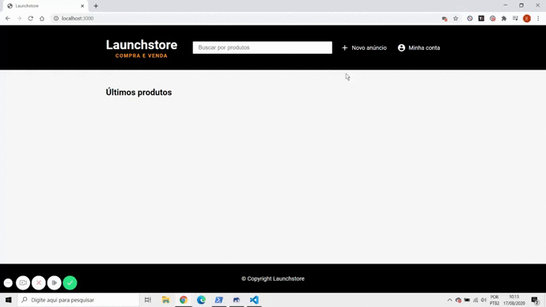

<h1 align="center">
    
</h1>

<h3 align="center">
  Cadastrando Usuários
</h3>

## :rocket: Sobre o módulo

Criação do cadastro de usuários da Launchstore, onde há verificação de e-mail e CPF/CNPJ para garantir que não há usuário cadastrado com estes dados, verificação de preenchimento de todos os campos, confirmação de senha e uso de Hash para salvar a senha no banco de dados. Segue a divisão do módulo:

### Registro de Usuários 

- **Apresentaçao do módulo e SQL da tabela de usuários;**
- **Rotas e Controllers de usuários;**
- **ES6, Classes e Herança;**
- **Formulário de registro;**
- **Estilos para formulário de registro;**

### Máscaras e Validações

- **Máscara de CPF, CNPJ e CEP;**
- **Estrutura de validação de email;**
- **Expressão regular para validar email;**
- **Aplicando validação de email;**
- **Mostrando resultado visual da validação;**
- **Validação de CPF, CNPJ e CEP;**
- **Query dinâmica para buscar usuários;**
- **Validando registro de usuários no backend;**
- **Organizando validações com validators;**

### Mensagens de alerta

- **Mensagens de erros aos usuários;**
- **Refatorando estilos CSS;**
- **Customizando mensagens de alerta;**

### Segurança

- **Criptografia de senha;**

O gif abaixo mostra o resultado de como ficou o sistema de cadastro de usuários.

## :rocket: Resultados

### Feito durante as aulas

