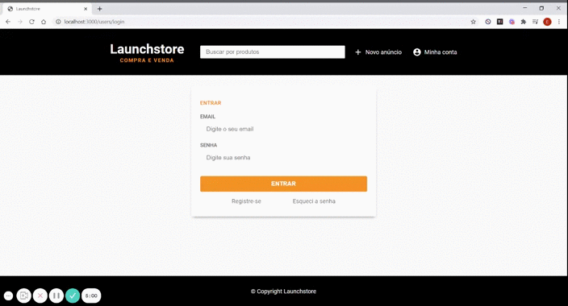

<h1 align="center">
    
</h1>

<h3 align="center">
  NodeJS Avançado
</h3>

## :rocket: Sobre o módulo

Neste módulo foi ensinado mais conceitos sobre NodeJS. Foi aplicado o padrão MVC de arquitetura, refatorado diversos códigos de controllers e models, utilizado um script de população automática e aleatória do banco de dados, entre outros assuntos. Segue a forma como foi dividido:

### NodeJS Avançado

- **Padrão MVC;**
- **Criando Base Model;**
- **Utilizando o Base Model;**
- **Ajustes nos Controllers;**
- **Ajustes nos Controllers - Continuação;**
- **Seeds de Usuários com Faker;**
- **Seeds de Produtos e Imagens;**
- **Correção de Bugs Após Refatoração dos Models;**
- **Serviço de Carregamento de Produtos;**
- **Utilizando o Serviço de Carregamento de Produtos;**
- **Ajuste na pesquisa;**
- **Validação Back e Front end dos Produtos;**
- **Estrutura da Listagem de Anúncios do Usuário;**
- **Estilizando a Página de Listagem de Anúncios;**
- **Padronizando Estilo dos Cards;**
- **Pedido de Compra;**
- **Animações com Lottie e Mensagens pós Pedido;**

## :rocket: Resultados

### Feito durante as aulas

