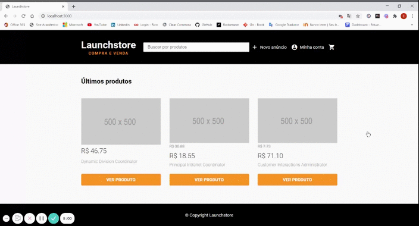

<h1 align="center">
    
</h1>

<h3 align="center">
  Funcionalidades Extras para a Launchstore
</h3>

## :rocket: Sobre o módulo

Como o próprio nome do módulo já diz, o foco foi no desenvolvimento de novas funcionalidades para a Launchstore, como por exemplo as funcionalidades de carrinho de compras e realização de pedidos. Segue a forma como foi dividido:

### Funcionalidades Extras para a Launchstore

- **Estrutura do Carrinho;**
- **Adicionando Itens ao Carrinho;**
- **Removendo Item do Carrinho;**
- **Deletando Itens do Carrinho;**
- **Estrutura HTML do Carrinho;**
- **Estilizando o Carrinho;**
- **Utilizando a Funcionalidade de Adicionar ao Carrinho;**
- **Utilizando a Funcionalidade Remover 1 item do Carrinho;**
- **Carrinho Vazio;**
- **Adicionar o Carrinho ao Menu;**
- **Tabela de Pedidos;**
- **Criar Pedidos;**
- **Dados do Pedido;**
- **Estrutura HTML dos Meus Pedidos;**
- **Estilo da Página Meus Pedidos;**
- **Service de Pedidos;**
- **Minhas Vendas e Detalhes do Pedido;**
- **Estilo da página Detalhes do Pedido;**
- **Menu para Editar Pedido;**
- **Aplicar Dropdown no Menu Principal;**
- **Mudar Status do Pedido;**
- **Estratégia de Soft Delete no Banco de Dados;**
- **Soft Delete na Aplicação;**

## :rocket: Resultados

### Feito durante as aulas

